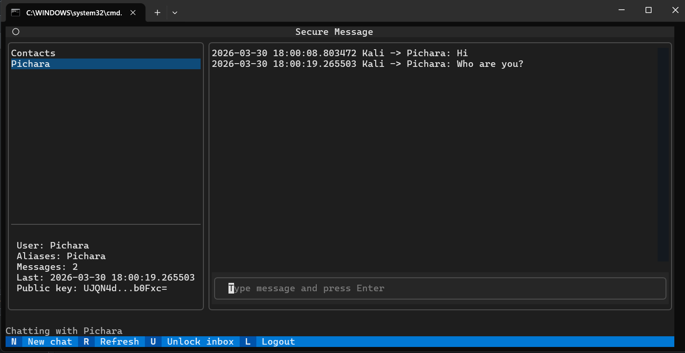

# Secure Message System (Overview)

Academic secure messaging project with **end-to-end encryption (E2EE)** and explicit **OWASP Top 10** alignment.

## Core Concepts (Concise)
1. **E2EE by design**: messages are encrypted client‑side (AES‑GCM); the server stores only ciphertext.
2. **Key management**: clients generate key pairs; private keys are encrypted with a password‑derived key.
3. **Zero‑knowledge backend**: the server cannot decrypt message content.
4. **Defense in depth**: stronger registration passwords, role-gated admin views, input validation, and secure error handling.

## OWASP Top 10 Mapping (Summary)
1. **Broken Access Control**: server enforces per‑user message access.
2. **Cryptographic Failures**: E2EE, strong KDF, AES‑GCM integrity.
3. **Injection**: parameterized SQL queries.
4. **Insecure Design**: threat model + data flow documented.
5. **Security Misconfiguration**: secure headers and safe defaults.
6. **Vulnerable Components**: minimal dependencies, pinned versions.
7. **Identification & Auth Failures**: hashed passwords, session controls.
8. **Integrity Failures**: authenticated encryption + TLS.
9. **Logging & Monitoring**: audit logs for auth and message events.
10. **SSRF/XSS/CSRF**: input/output controls, CSRF protection for state changes.

## Architecture (High Level)
- **Clients (Web/CLI)** → **Backend API** → **PostgreSQL**
- API handles auth, public key lookup, and message storage (ciphertext only).
- CLI defaults to a Textual TUI for messaging workflows.
- Encrypted image attachments use the same message pipeline as text messages: the client encrypts a structured attachment envelope before upload, and recipients decrypt it locally.

## CLI Quickstart (TUI)
```powershell
python secure_message_cli.py
```
TUI hotkeys:
- `n` new chat
- `r` refresh contacts
- `u` unlock inbox (decrypt)
- `l` logout

Current messaging support:
- Text messages remain compatible with the original flow.
- Image attachments are sent as encrypted message payloads and stay opaque to the backend.
- Admin sessions can list registered usernames and delete non-admin accounts.
- Contacts are stored per user in PostgreSQL, not in local CLI state.



## API (Current)
1. `GET /health`
2. `GET /openapi.json`
3. `GET /api/docs`
4. `POST /api/register`
5. `POST /api/login`
6. `POST /api/logout`
7. `GET /api/me`
8. `GET /api/users/{username}/public-key`
9. `GET /api/admin/users`
10. `DELETE /api/admin/users/{username}`
11. `POST /api/messages`
12. `GET /api/messages`
   - Optional query params: `with`, `limit`, `order` (`asc|desc`), `before_id`

## API Notes
- CORS defaults to `*` and can be overridden with `CORS_ORIGIN`.
- Responses are JSON; errors use `{"error":"..."}`.
- `order` and `before_id` operate on message IDs for stable pagination.
- OpenAPI spec available at `/openapi.json` and human-friendly docs at `/api/docs`.

## Security Controls (Additional)
- Input validation with bounded username/password lengths and allowed characters.
- Registration passwords must be 8-128 characters and include at least one number and one special character.
- Request body size limits to reduce abuse.
- Basic in-memory rate limiting on login/register (per IP and username).
- Token cleanup for expired bearer tokens.
- Optional HSTS via `HSTS_ENABLED=true` when serving over HTTPS.
- CLI config masks sensitive values by default; local history can be disabled.
- Admin listing endpoints return usernames only, never password hashes, keys, or message metadata.
- Admin delete operations are limited to non-admin accounts.

## Stack (Reference)
- Backend: C# / ASP.NET Core 8
- DB: PostgreSQL
- CLI: Python (Typer, Requests, Cryptography, Textual)
